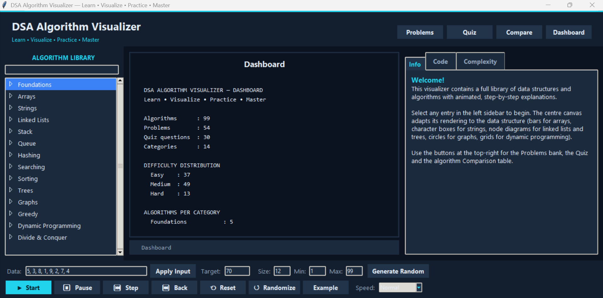
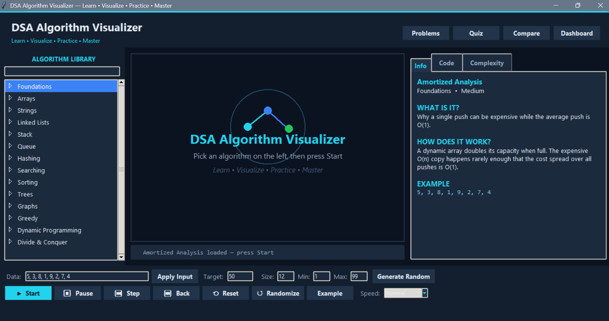
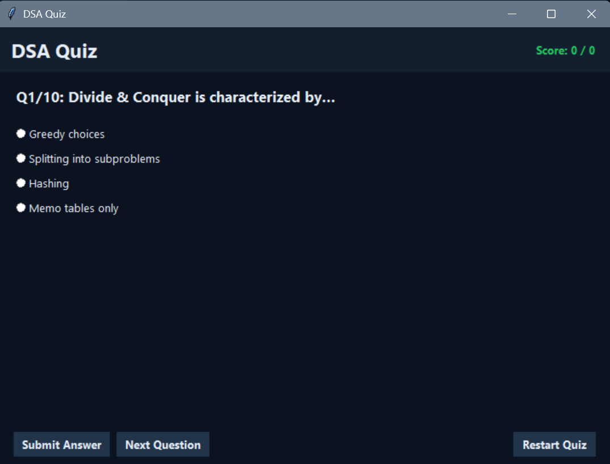
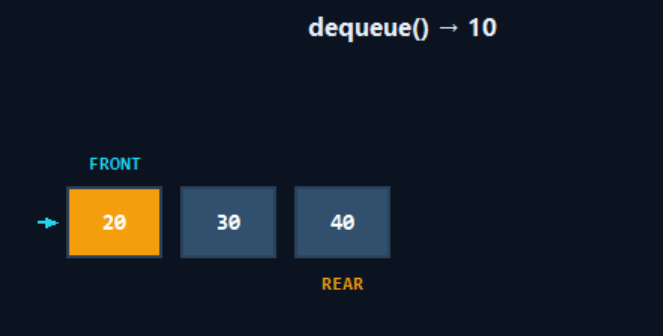
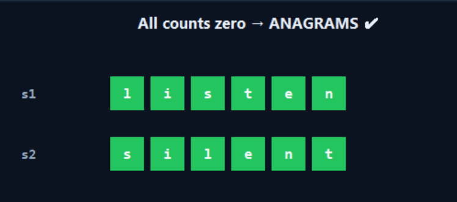
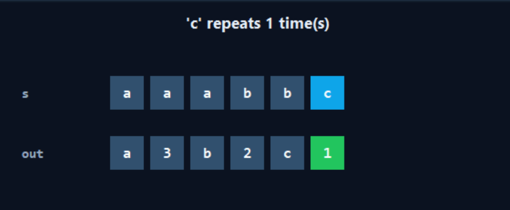

<!-- 
  DSA Algorithm Visualizer - README 
  Replace screenshot paths if you move files outside the Screenshots folder.
-->

<div align="center">

  <!-- Animated Header -->
  

  <p>
    <strong>A professional, interactive, single-file desktop application to visualize 60+ Data Structures & Algorithms with step-by-step animations, complexity analysis, built-in problems, and a quiz mode.</strong>
  </p>

  <!-- Animated Badges -->
  <p>
    <a href="https://www.python.org/downloads/"></a>
    <a href="#"></a>
    <a href="LICENSE"></a>
    <a href="#"></a>
    <a href="https://github.com/MUdevelops/DSA-Algorithms-Visualizer-Python/stargazers"></a>
  </p>

  <!-- Navigation Links -->
  <p>
    <a href="#-screenshots">Screenshots</a> •
    <a href="#-features">Features</a> •
    <a href="#-installation">Installation</a> •
    <a href="#-usage">Usage</a> •
    <a href="#-algorithms-covered">Algorithms</a> •
    <a href="#-architecture">Architecture</a> •
    <a href="#-contributing">Contributing</a>
  </p>

</div>

---

## 🎬 Screenshots

Explore the visual interface of the DSA Algorithm Visualizer. *(Click on any image to view it in full size.)*

### 🏠 Core Interface & Dashboard
| Splash Screen | Dashboard | Home |
| :---: | :---: | :---: |
|  |  |  |

### 🧩 Practice & Quiz Modules
| Practice Problems | Quizzes | Sorting Comparison |
| :---: | :---: | :---: |
|  |  |  |

### 📊 Sorting & Searching
| Array Sorted | Swapping Animation | Finding Number |
| :---: | :---: | :---: |
|  |  |  |
| **Finding Smallest Number** | **Minimum Number Find** | |
|  |  | |

### 🔗 Linked Lists & Stack/Queue
| Linkedlist Built | Detect Cycle | No Cycle |
| :---: | :---: | :---: |
|  |  |  |
| **Stack Pop and Push** | **Dequeue** | |
|  |  | |

### 🌳 Trees & Graphs
| Binary Search Tree | Level Order BFS | Dijkstra Animation |
| :---: | :---: | :---: |
|  |  |  |
| **Bellman Ford** | | |
|  | | |

### 🧠 Algorithms & Hashing
| Anagram | Duplicate Checker | C-Repeats-1-Time |
| :---: | :---: | :---: |
|  |  |  |
| **Huffman Codes** | **Climbing Stairs** | **6+63 Animation** |
|  |  |  |

---

## ✨ Features

<details open>
<summary><strong>Click to expand/collapse features</strong></summary>

- 🎨 **Modern Dark UI** – Professional educational interface built with `ttk` and custom styling.
- ⚡ **60+ Algorithms** – Sorting, Searching, Arrays, Strings, Linked Lists, Stack, Queue, Hashing, Trees, Graphs, Greedy, DP, Divide & Conquer.
- 🎞️ **Step-by-Step Animation** – Start, Pause, Step, Back, Reset, and Speed control (Very Slow → Very Fast).
- 📊 **Adaptive Visualizations** – Bars for arrays, character boxes for strings, node diagrams for linked lists & trees, circles for graphs, grids for DP.
- 📚 **Learn Mode** – Description, How it works, Example, Complexity, and Python code for every algorithm.
- 🧩 **50+ Practice Problems** – Filter by difficulty & category, view hints and full solutions.
- 🧠 **Quiz Mode** – Multiple-choice questions with instant feedback and score tracking.
- 📈 **Algorithm Comparison** – Sort & search algorithms side-by-side in a table.
- 📂 **Custom Input** – Enter your own arrays/strings, or generate random data with custom size & range.
- 🔍 **Live Search** – Filter the algorithm library by typing (e.g., "sort", "binary").
- 💾 **Copy Code** – One-click copy of any algorithm's Python implementation.
- 🛡️ **Robust Error Handling** – Never crashes on invalid input; friendly message boxes.
- 🐍 **Single File** – `dsa_visualizer.py` – no external dependencies beyond the standard library.

</details>

---

## 🚀 Installation

### Prerequisites
- **Python 3.10+** (tested on 3.11.9)
- `tkinter` (usually bundled with Python; on Linux you may need `sudo apt install python3-tk`)

### Clone & Run
```bash
# Clone the repository
git clone https://github.com/MUdevelops/DSA-Algorithms-Visualizer-Python.git

# Navigate into the directory
cd DSA-Algorithms-Visualizer-Python

# Run the application
python dsa_visualizer.py
